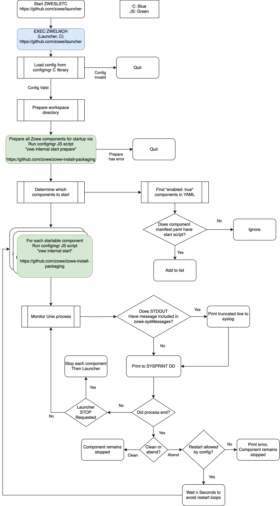

This program and the accompanying materials are
made available under the terms of the Eclipse Public License v2.0 which accompanies
this distribution, and is available at https://www.eclipse.org/legal/epl-v20.html

SPDX-License-Identifier: EPL-2.0

Copyright Contributors to the Zowe Project.

# Zowe Launcher

The Zowe launcher is a part of the Zowe server architecture that was added as an optional program for HA/FT usage in v1.
In v2, the Zowe laucher became the sole way to start the Zowe servers.
The launcher's purpose is to start, restart, and stop each Zowe server component which has a `start` command,
and in doing so it watches over such components for health (restarting them if they crash) and log management.

## Current features
* Stopping Zowe using the conventional `P` operator command
* Ability to handle `MODIFY` commands
* Stopping and starting specific Zowe components without restarting the entire Zowe

## Future features
* Issuing WTOs indicating the start and termination of specific components (this should simplify the integration with z/OS automation)
* Passing `MODIFY` commands to Zowe components
* Clean termination of the components in case if the launcher gets cancelled

## Building

```
cd zowe-launcher/build
./build.sh
```

The launcher binary will be saved into the bin directory.

## Testing

See [details](./test/README.md) in `test` directory.

## Prerequisites

* Zowe 2.4.0

## Deployment

* Find the JCL used to start your Zowe instance (ZWESLSTC)
* Stop that Zowe instance
* Find the dataset used by that STC
* Copy the binary from the bin directory into that dataset with whatever name you want
* If necessary, update the PGM name to match the name of the resulting copy you just did
* Restart that Zowe instance

## Operating the launcher

* To start the launcher use the `S` operator command:
```
S ZWESLSTC
```
* To stop use the `P` operator command:
```
P ZWESLSTC
```
* To stop a specific component use the following `MODIFY` command:
```
F ZWESLSTC,APPL=STOP(component_name)
```
* To start a specific component use the following `MODIFY` command:
```
F ZWESLSTC,APPL=START(component_name)
```
* To list the components use the following `MODIFY` command:
```
F ZWESLSTC,APPL=DISP
```

## Community

This part of Zowe is currently developed by the zOS squad, which you can find on Slack at [#zowe-zos-interface](https://openmainframeproject.slack.com/archives/C034VLT3W2G).

## Architecture

The launcher is a z/OS program which utilizes [configmgr](https://github.com/zowe/zowe-common-c/blob/v3.x/staging/c/configmgr.c) to read the Zowe config in order to determine which components to start, and then prepares Zowe to run, starts the components, and manages their unix processes.

It's behavior is summarized in this flow chart diagram.


